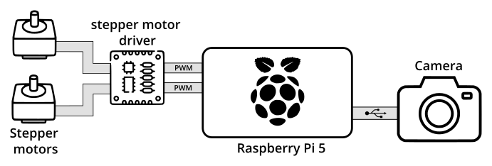

# Photohead

Photohead is a motorized pan and tilt head on which a camera can be mounted.\
A Raspberry Pi 5 is used to perform the following functions:
 - Acquisition of images from the camera.
 - Application of an object detection algorithm to the acquired images.
 - Control of the head's stepper motors to orient the camera towards the detected object(s).
 - Broadcast of the acquired image stream.

This list is not exhaustive, and other features may be added during development.

## Concept sketch

  

## System overview

  

## Repositories

The project is divided into 3 repositories:

- [soft](soft/README.md): contains the application code running on the Raspberry Pi 5.
- [mech](mech/README.md): contains the mechanical design files.(e.g.: 3D printed parts)
- [elec](elec/README.md): contains the electronic board (stepper motor driver) design files.
