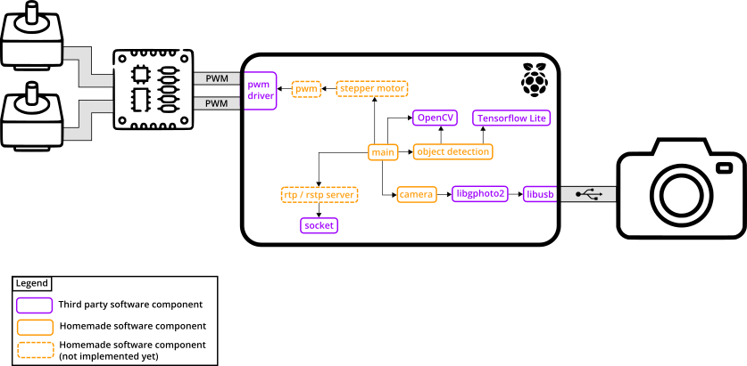

# Introduction

The Photohead application provides the following features:
 - Image acquisition from a camera using libgphoto2.
 - Image formatting using OpenCV.
 - Object detection on the acquired image using TensorFlow Lite and an object detection model.
 - PWM driving of the pan & tilt head stepper motors.
 - Streaming of the acquired images through an RTP / RTSP server.

# Object detection demo

# Software overview :mag_right:

🚧: **TODO**: Describe each software component

# Table of Contents :bookmark_tabs:

* [Requirements](doc/requirements.md)
* [Application's build and run](doc/application_build_and_run.md)
* [Miscellaneous](doc/miscellaneous.md)
