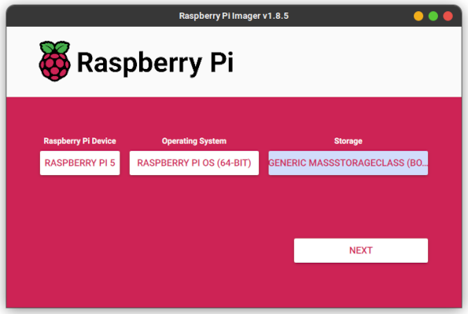
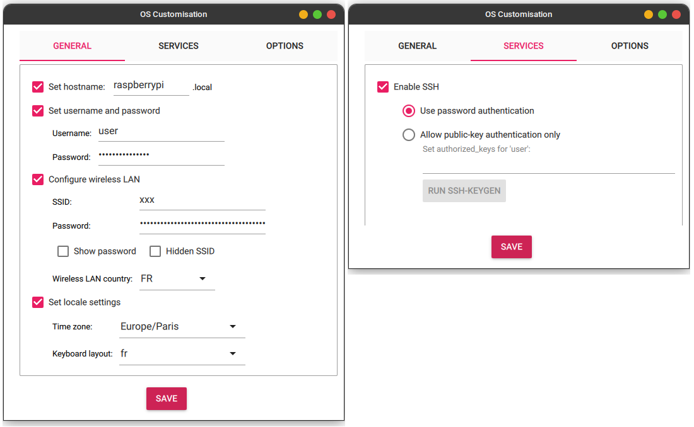

# Requirements

The Photohead application is meant to be executed on a Raspberry Pi 5 Linux distribution, and requires the installation of some third party software components in order to be functionnal.

## RPi5 OS installation

You can use Raspberry Pi Imager for flashing an SD card with the Raspberry Pi OS.



🚧: **TODO**: Once the RTP/RSTP server will be implemented, the OpenCV GUI should no longer be needed. Thus, it should be sufficient to install only the Raspberry Pi OS **Lite**.


Additionnally, you can enable SSH and provide your WiFi credentials.



Once the OS is installed, don't forget to upgrade your raspberry pi's packages.

```shell
sudo apt update && sudo apt upgrade
```

You might also want to install some development packages:
```shell
sudo apt-get install build-essential cmake
```

## libgphoto2 installation

First, you should check if your camera supports libgphoto2:
[libgphoto2 supported cameras](http://www.gphoto.org/proj/libgphoto2/support.php).

Some distribution come with some libgphoto2 packages already installed.\
This can be check using the following command:

```shell
apt list --installed | grep -i libgphoto2
```
> libgphoto2-6/stable,now 2.5.30-1 arm64 [installed,automatic]\
> libgphoto2-port12/stable,now 2.5.30-1 arm64 [installed,automatic]

In the example below, libgphoto2-6 and libgphoto2-port12 were already installed.
The libgphoto2-dev package is required as well, and can be install by doing the following command:
```shell
sudo apt install libgphoto2-dev
```

Use the following command if you want to check the location of the package files.\
e.g.:
```shell
dpkg -L libgphoto2-dev
```

<details>
  <summary><span style="color:blue"><b>Alternatively, you can install the library from the source files</b></span><br><br></summary>

Download the compressed libgphoto2 source files (adapt the version number to the latest available):
```shell
wget https://github.com/gphoto/libgphoto2/releases/download/v2.5.31/libgphoto2-2.5.31.tar.bz2
tar -xf libgphoto2-2.5.31.tar.bz2
rm libgphoto2-2.5.31.tar.bz2
```

Navigate to the libgphoto2 source files folder:
```shell
cd libgphoto2-2.5.31
```

Configure the build:
```shell
autoreconf --install --symlink
./configure --prefix=/usr/local
```

Perform the build itself:
```shell
make -j $(nproc)
```

Once the library is built, install the library files (header files, shared library files, binary files, etc...):
```shell
sudo make install
```
</details>

## OpenCV installation

OpenCV can also be installed via the APT package manager:
```shell
sudo make install libopencv-dev
```

🚧: **TODO**: Once the RTP/RSTP server will be implemented, the OpenCV GUI should no longer be needed. Thus, it should be sufficient to install only the libopencv-**core**-dev package.

<details>
  <summary><span style="color:blue"><b>Alternatively, you can install the library from the source files</b></span><br><br></summary>

First, you will need to install some dependencies:
```shell
sudo apt-get install libjpeg-dev libpng-dev
sudo apt-get install libgtk2.0-dev libcanberra-gtk* libgtk-3-dev
```

🚧: **TODO**: Once the RTP/RSTP server will be implemented, libgtk2 and libcanberra should no longer be needed.

You will have to download the OpenCV source files:
```shell
wget -O opencv.zip https://github.com/opencv/opencv/archive/4.x.zip
unzip opencv.zip
rm opencv.zip
```

And move to the OpenCV folder:
```shell
cd opencv-4.x
```

Then, you must create the build/ folder:
```shell
mkdir build && cd build
```

Once, in the build folder, you can configure the CMake build:
```shell
cmake -D CMAKE_BUILD_TYPE=RELEASE \
-D CMAKE_INSTALL_PREFIX=/usr/local \
-D ENABLE_NEON=ON \
-D BUILD_ZLIB=ON \
-D BUILD_OPENMP=ON \
-D BUILD_TIFF=OFF \
-D BUILD_OPENJPEG=OFF \
-D BUILD_JASPER=OFF \
-D BUILD_OPENEXR=OFF \
-D BUILD_WEBP=OFF \
-D BUILD_TBB=ON \
-D BUILD_IPP_IW=OFF \
-D BUILD_ITT=OFF \
-D WITH_OPENMP=ON \
-D WITH_OPENCL=OFF \
-D WITH_AVFOUNDATION=OFF \
-D WITH_CAP_IOS=OFF \
-D WITH_CAROTENE=OFF \
-D WITH_CPUFEATURES=OFF \
-D WITH_EIGEN=OFF \
-D WITH_GSTREAMER=ON \
-D WITH_GTK=ON \
-D WITH_IPP=OFF \
-D WITH_HALIDE=OFF \
-D WITH_VULKAN=OFF \
-D WITH_INF_ENGINE=OFF \
-D WITH_NGRAPH=OFF \
-D WITH_JASPER=OFF \
-D WITH_OPENJPEG=OFF \
-D WITH_WEBP=OFF \
-D WITH_OPENEXR=OFF \
-D WITH_TIFF=OFF \
-D WITH_OPENVX=OFF \
-D WITH_GDCM=OFF \
-D WITH_TBB=ON \
-D WITH_HPX=OFF \
-D WITH_EIGEN=OFF \
-D WITH_V4L=ON \
-D WITH_LIBV4L=ON \
-D WITH_VTK=OFF \
-D WITH_QT=OFF \
-D BUILD_opencv_python3=ON \
-D BUILD_opencv_java=OFF \
-D BUILD_opencv_gapi=OFF \
-D BUILD_opencv_objc=OFF \
-D BUILD_opencv_js=OFF \
-D BUILD_opencv_ts=OFF \
-D BUILD_opencv_dnn=OFF \
-D BUILD_opencv_calib3d=OFF \
-D BUILD_opencv_objdetect=OFF \
-D BUILD_opencv_stitching=OFF \
-D BUILD_opencv_ml=OFF \
-D BUILD_opencv_world=OFF \
-D BUILD_EXAMPLES=OFF \
-D PYTHON3_PACKAGES_PATH=/usr/lib/python3/dist-packages \
-D OPENCV_ENABLE_NONFREE=OFF \
-D OPENCV_GENERATE_PKGCONFIG=ON \
-D INSTALL_C_EXAMPLES=OFF \
-D INSTALL_PYTHON_EXAMPLES=OFF ..
```

As you can see, a large number of OpenCV modules have been removed from the build. We won't be needing them anyway, and this will make the compilation faster and the installation lighter.

You can then proceed with the build itself (this can take quite a while):
```shell
make -j $(nproc)
```

And finally, you can install OpenCV:
```shell
sudo make install
```

</details>


## TensorFlow Lite installation

Tensorflow Lite can be quite tedious to install. The official documentation gives little inside on how to build and install Tensorflow Lite using CMake (especially if you want to build it as a shared library).

Also at the time of writing, there doesn't seem to be an official APT package to easily install Tensorflow Lite.

Below is the "easiest" method I found (after a lot of trial and error) in order to build and install Tensorflow Lite from the source code.

First, we will need to install some dependencies: libabsl-dev and libeigen3-dev:
```shell
sudo apt install libabsl-dev libeigen3-dev
```

Download the tensorflow source files:
```shell
wget -O tensorflow.zip https://github.com/tensorflow/tensorflow/archive/v2.15.0.zip
unzip tensorflow.zip
rm tensorflow.zip
cd tensorflow-2.15.0
```

You will have to apply a patch to one of the tensorflow CMake file, otherwise, the cmake configuration might fail.\
In the following file:
```
tensorflow/lite/tools/cmake/modules/ml_dtypes/CMakeLists.txt
```
Apply the following patch:
```diff
-target_include_directories(ml_dtypes INTERFACE
- "${ML_DTYPES_SOURCE_DIR}"
- "${ML_DTYPES_SOURCE_DIR}/ml_dtypes")
+target_include_directories(ml_dtypes INTERFACE
+  "$<BUILD_INTERFACE:${ML_DTYPES_SOURCE_DIR}>" "$<INSTALL_INTERFACE:${CMAKE_INSTALL_INCLUDEDIR}>"
+  "$<BUILD_INTERFACE:${ML_DTYPES_SOURCE_DIR}/ml_dtypes>" "$<INSTALL_INTERFACE:${CMAKE_INSTALL_INCLUDEDIR}/ml_dtypes>")
```

Then, create a build/ folder in the tensorflow root directory:
```shell
mkdir build && cd build
```

Once in the build/ folder, you can perform the CMake configuration:
```shell
cmake ../tensorflow/lite/ \
-D TFLITE_ENABLE_INSTALL=ON \
-D FETCHCONTENT_FULLY_DISCONNECTED=OFF \
-D BUILD_SHARED_LIBS=ON \
-D CMAKE_FIND_PACKAGE_PREFER_CONFIG=ON
```

CMake might display some error messages:
> CMake Error: install(EXPORT "tensorflow-liteTargets" ...) includes target "tensorflow-lite" which requires target "ruy" that is not in any export set.\
> CMake Error: install(EXPORT "tensorflow-liteTargets" ...) includes target "tensorflow-lite" which requires target " " that is not in any export set.\
> CMake Error: install(EXPORT "tensorflow-liteTargets" ...) includes target "tensorflow-lite" which requires target "XNNPACK" that is not in any export set.

This is because some Tensorflow Lite dependencies (ruy, pthreadpool and XNNPACK) have not been installed. But these missing dependencies will then be built and installed at the same time as Tensorflow Lite, so this won't cause any problems.

You can then perform the build itself (this will take a while):
```shell
make -j $(nproc)
```

You can finally install Tensorflow Lite:
```shell
sudo make install
```

Note that you will find in the build/ folder, a file called install_manifest.txt, which list the location of installed files (tensorflow lite, as well as some of its dependencies).

## Enabling PWM

https://blog.oddbit.com/post/2017-09-26-some-notes-on-pwm-on-the-raspb/

In order to have the hardware PWM activated on the Raspberry Pi, you'll have to edit the /boot/config.txt file and add an overlay.
Edit the /boot/firmware/config.txt file and add the dtoverlay line in the file:

Now /boot/firmware/config.txt (not /boot/config.txt)

sudo nano /boot/firmware/config.txt

dtoverlay=pwm-2chan

reboot

/sys/class/pwm/

pin 18
echo 0 > export

pin 19
echo 1 > export

## Usefull links
- [libgphoto2 supported cameras](http://www.gphoto.org/proj/libgphoto2/support.php)
- [github - libgphoto2/install](https://github.com/gphoto/libgphoto2/blob/master/INSTALL)
- [Q-engineering - Install OpenCV Lite 4.5 on Raspberry Pi](https://qengineering.eu/install-opencv-lite-on-raspberry-pi.html)
- [Build TensorFlow Lite with CMake](https://www.tensorflow.org/lite/guide/build_cmake)
- [CMake: target_include_directories() prints an error when I try to add the source directory itself, or one of its subdirectories](https://stackoverflow.com/questions/25676277/cmake-target-include-directories-prints-an-error-when-i-try-to-add-the-source)