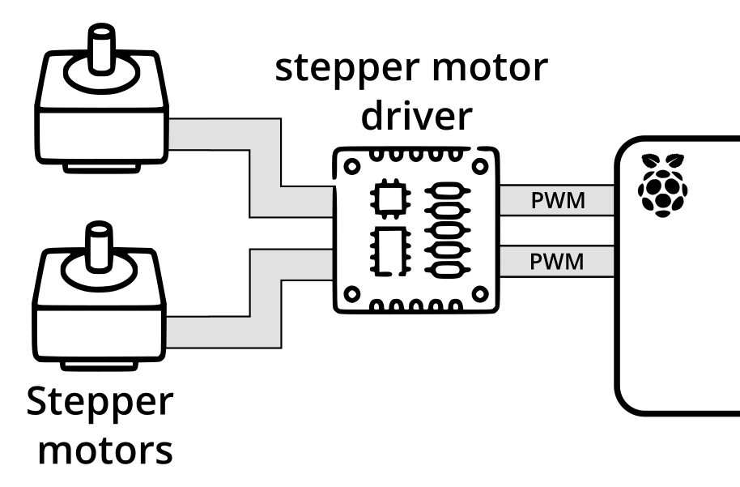
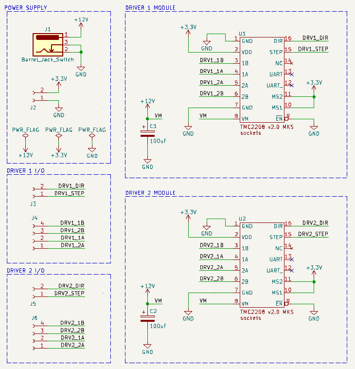

# Photohead electronics

The Photohead board aims to drive the stepper motors from PWM signals coming from the Raspberry Pi 5.

To achieve this, two TMC2208 stepper motor drive chips drive two NEMA 17 stepper motors (one for tilting, and one for panning).

🚧: **TODO**: Update overview to show +12V and 3.3V power supplies, GND, and DIR.

**KiCad v8.0 is used throughout this project.**

## Schematic

## Naked board

## Assembled board

## Some therorical stuffs

With microstepping enabled (1/16 microsteps on the TMC2208 chip), and with a step angle of 1.8° on NEMA 17 motors:\
Periods per revolution = (360° / (1.8° / 16)) = 3200 periods\
:arrow_right: 3200 PWM periods are required for the motor to make 1 complete revolution.

If the PWM period is 1 millisecond:\
Full revolution time  = 3200 x 1ms = 3.2s\
:arrow_right: The motor would complete a full revolution in 3.2 seconds.

🚧: **TODO**: Explain Vref calculation.
